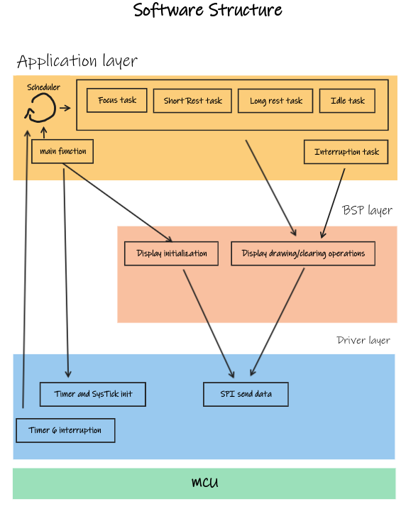

# Pomogotchi

Pomogotchi is a small STM32-based device aimed to be a company while completing daily tasks. Inspired by the [Pomodoro technique](https://en.wikipedia.org/wiki/Pomodoro_Technique), Pomogotchi is a simple implementation of the Pomodoro alarm without the need of setting alarms in distracting devices like a smartphone.

Pomogotchi is designed wih a [bare-metal](https://en.wikipedia.org/wiki/Bare_machine) approach, implementing just what is needed. A [2.13inch e-paper display](https://www.waveshare.com/product/displays/e-paper/2.13inch-e-paper-hat-plus.htm) is used as the display interface since it can retain an image without any energy supplied. These traits make Pomogotchi a simple device with low current consumption.

# Disclaimer!

To design Pomogotchi, only CMSIS libraries were used (no HAL layer nor e-ink paper libraries). Instead, all displaying functions, images and fonts are developed from scratch, since the goal of Pomogotchi isn't to create a visually appealing device but to serve as a hands-on project.


# Table of Contents


# Set up and Requirements

### Software Requirements:
- GNU make
- [CMSIS6](https://github.com/ARM-software/CMSIS_6) header files
- [CMSIS device for STM32 F4 devices](https://github.com/STMicroelectronics/cmsis_device_f4) header files
- ARM gcc cross-toolchain
- OpenOCD
- gdb-multiarch
- clang-format-15

### Harware Requirements:
- 2.13 e-Paper HAT
- STM32F4 Board

### Set up steps:
Since this project is developed without any IDE, third party libraries need to be cloned on the environment. This next procedure is encouraged to build with the provided Makefile:

- Set the ENVIRONMENT_HOME_DIR variable with the name of the path where Pomogotchi repository is clone in the .bashrc file:

```
echo "export ENV_HOME_DIR="<your_path>\"" >> ~/.bashrc
```
> [!IMPORTANT]
> Use >> instead of > to append instead of overwritting

- clone the CMSIS files. In this project:
    - create a directory called cmsis_header_files on the root directory
    - clone CMSIS6 project (Core definitions)
    - clone CMSIS device for STM32F4 devices (Board definitions)

These steps can be followed but there are not mandatory. Instead, you can define your own path where header files are stored, just CMSIS_CORE and CMSIS_DEVICE variables in the Makefile need to be changed. 

# Project file structure

- bsp: e-ink display functionality
- build:
    - bin: executable file loaded in the MCU
    - debug: .log file (created with OpenOCD)
    - map: .map file
    - obj: object files
- media: images and videos
- user: task and main file
- util: miscellaneous files (start up file, linked script, system calls, dockerfile, OpenOCD config file)

# Software architecture




